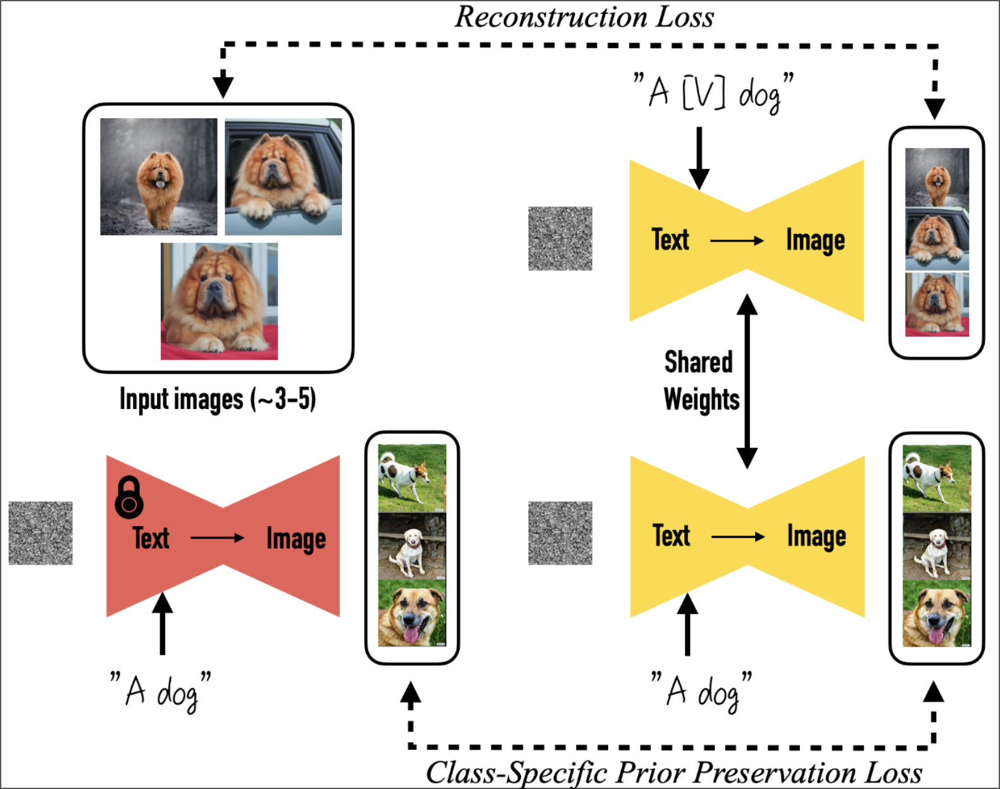
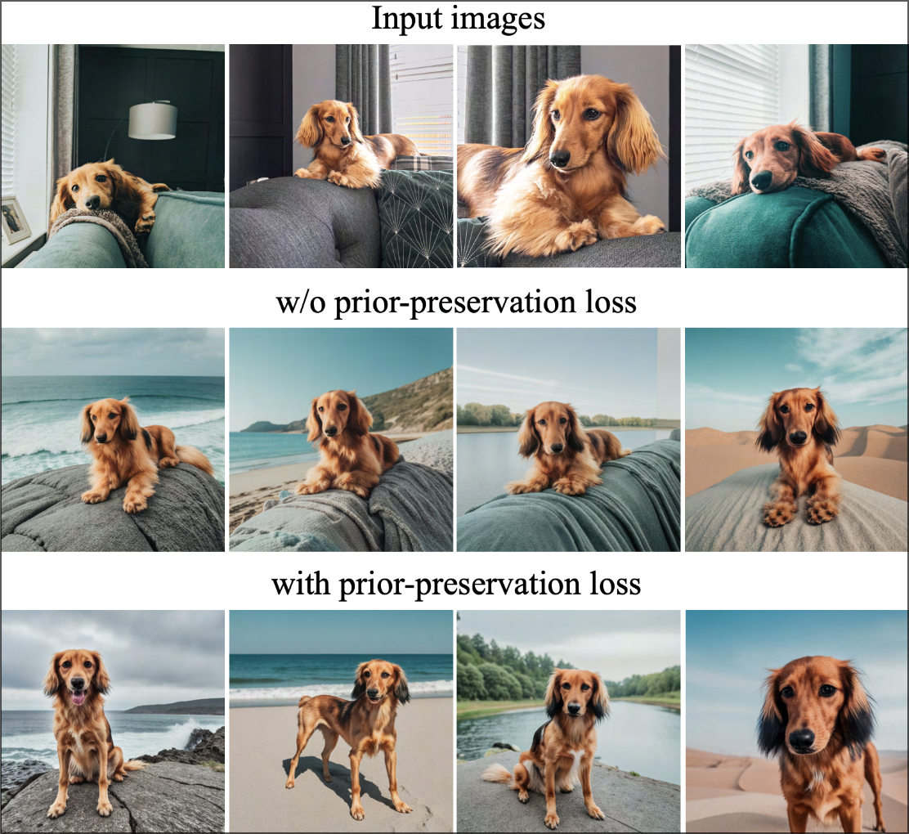
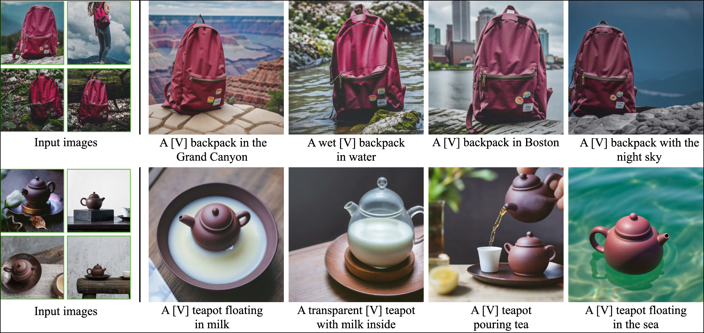
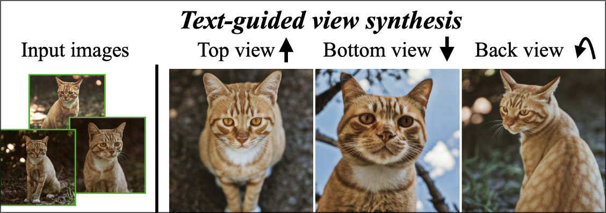
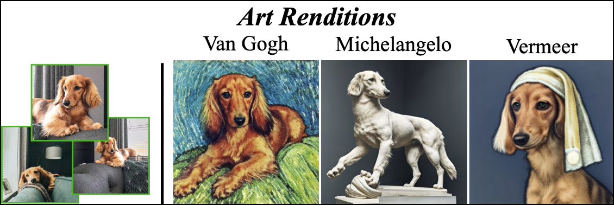
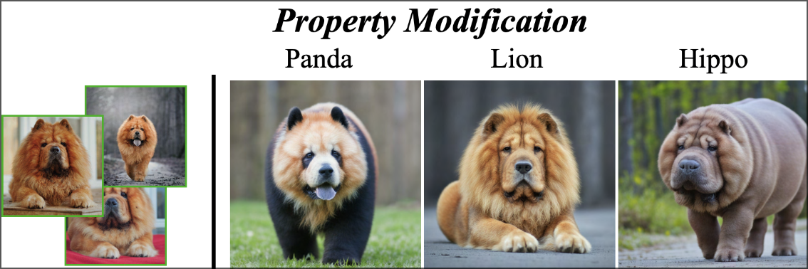

# DreamBooth
>It’s like a photo booth, but once the subject is captured, it can be synthesized wherever your dreams take you…

Оригинальная статья: [DreamBooth: Fine Tuning Text-to-Image Diffusion Models for Subject-Driven Generation](https://arxiv.org/pdf/2208.12242.pdf)
## Проблематика и постановка задачи
Современные большие text-to-image модели могут достаточно точно и разнообразно генерировать изображения по текстовому запросу. Однако, возникает проблема, если мы хотим получить изображение с конкретным объектом, примеры которого у нас есть (3-5 изображений), но в измененном контексте, задаваемом промтом. Например, сгенерировать фотографию с собой/своим животным/любимой вещью в известном туристическом месте. Данную задачу позволяет решить подход DreamBooth.
## Основная идея
Тривиальный способ научить диффузионную модель генерировать заданный объект — это присвоить ему уникальный идентификатор (предлагается брать наиболее редко используемые токены, ведь от их оригинальной смысловой нагрузки будет проще всего избавиться, в промте будем обозначать как 'a \[V\] \[class noun\]'), чтобы модель понимала, что в промте речь идет про конкретный объект, а затем ее зафайнтьюнить как обычную диффузию. Функция потерь запишется как
```math
\mathbb{E}_{x, c, \epsilon, t} [w_t \|\hat{x}_\theta(\alpha_t x + \sigma_t \epsilon, c) - x\|_2^2],
```
где $x$ — истинное изображение, $c$ — вектор, полученный из текстового промта, $\epsilon \sim N(0, 1)$ — шум из нормального распределения, $\alpha_t, \sigma_t, w_t$ — величины, контролирующие шум и качество входного изображения, являются функциями времени $t \sim U([0, 1])$, $\hat{x}_\theta$ — диффузионная модель, предобученная удалять шум из зашумленного изображения $z_t := \alpha_t x + \sigma_t \epsilon$.
Такое решение действительно позволит создавать изображения с нашим объектом, однако, появляются две проблемы:
1. Language drift. Изначально появился в языковых моделях, предобученных на больших корпусах текста. После файнтьюна под узкую задачу такие модели переставали понимать синтаксис и семантику языка. При переносе на диффузионные модели, получаем, что нейросеть забывает, как должны строиться изображения, располагаться объекты по отношению друг к другу. Более того, весь класс, которому принадлежит наш объект, может у модели теперь ассоциироваться с конкретным его экземпляром.
2. Reduced output diversity. Text-to-image диффузионные модели выдают широкий спектр разнообразных изображений. Но после дообучения на небольшом наборе данных это разнообразие теряется, и мы больше не в состоянии получить фотографию желаемого объекта в другой позе или с другого ракурса.

Побороть обе проблемы можно, если дообучать не только на небольшом датасете с интересуемым объектом, но и на изображениях, генерируемых моделью до файнтьюна по промту, содержащему лишь класс объекта. Таким образом, мы и сохраняем разнообразие и не переобучаемся на маленькой выборке.

Лосс-функция теперь перепишется как
```math
\mathbb{E}_{x, c, \epsilon, \epsilon', t} [w_t \|\hat{x}_\theta(\alpha_t x + \sigma_t \epsilon, c) - x\|_2^2 + \lambda w_{t'} \|\hat{x}_\theta(\alpha_{t'} x_{pr} + \sigma_{t'} \epsilon', c_{pr}) - x_{pr}\|_2^2],
```
здесь все обозначения совпадают с предыдущей формулой, за исключением: 
* $x_{pr} = \hat{x}(z_{t_1}, c_{pr})$ — данные, сгенерированные предобученной диффузионной моделью с замороженными весами из шума $z_{t_1} \sim N(0, 1)$
* $c_{pr} := \Gamma(f('\text{a [class noun]}'))$ — вектор на выходе энкодера текста
* $\lambda$ — параметр, контролирующий отношение слагаемых.

Первое слагаемое назовем Reconstruction Loss, второе — Class-Specific Prior Preservation Loss. Измененный процесс файнтьюна можно изобразить в виде схемы:

## Результаты из оригинальной статьи

Как можно заметить, на изображениях входного датасета собака лежит на мягких поверхностях, и на сгенерированных изображениях без prior-preservation loss'а она тоже лежит на похожих поверхностях. А на изображениях, полученных с prior-preservation loss'ом, собака стоит и сидит на отличающихся поверхностях.

Также авторам удалось достичь успеха в следующих задачах синтеза изображений:
* Recontextualization — изменение окружения объекта
  
* Novel View Synthesis — синтез новых ракурсов
  
* Art Renditions — генерация в стиле картин великих художников
  
* Property Modification — изменение качеств объекта
  